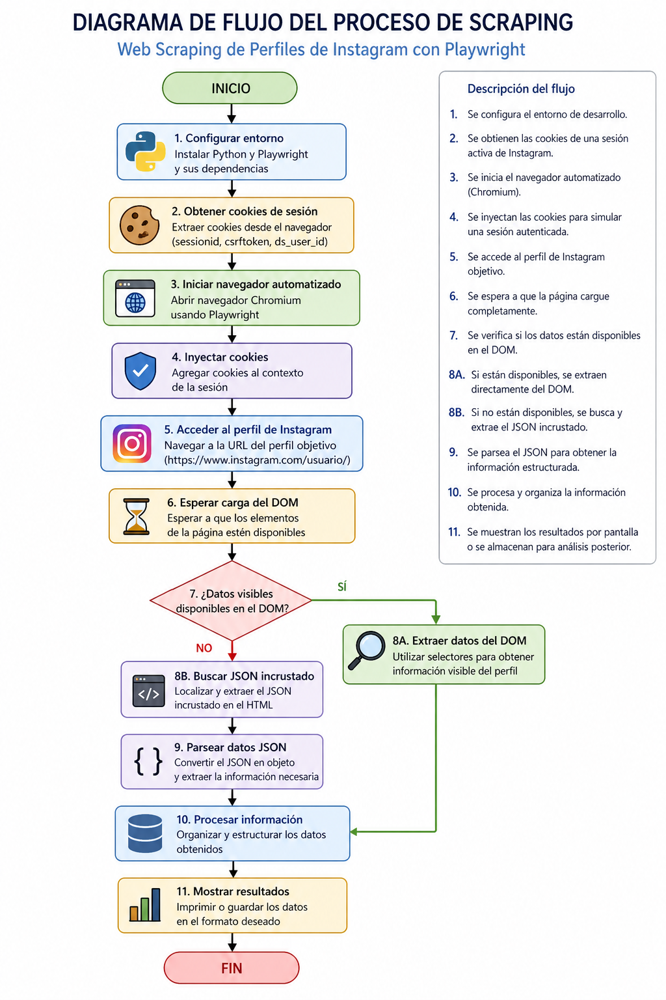

📘 Web Scraping de Perfiles de Instagram mediante Automatización con Playwright
1. Introducción

En el contexto actual de la transformación digital, la extracción automatizada de información desde plataformas web se ha convertido en una técnica clave para el análisis de datos. Este proyecto presenta el desarrollo de un sistema de web scraping orientado a la obtención de información pública de perfiles de la red social Instagram.

El enfoque propuesto utiliza herramientas de automatización que simulan el comportamiento humano en un navegador, permitiendo superar restricciones comunes como autenticación obligatoria o bloqueos por tráfico automatizado.

2. Objetivos
2.1 Objetivo general

Desarrollar un sistema de scraping automatizado capaz de extraer información relevante de perfiles de Instagram utilizando técnicas de simulación de navegador.

2.2 Objetivos específicos
Implementar un entorno de automatización web mediante Playwright
Simular una sesión autenticada mediante el uso de cookies
Extraer datos estructurados desde el DOM y contenido embebido
Analizar la viabilidad del scraping frente a restricciones de la plataforma
3. Marco teórico

El web scraping es una técnica utilizada para extraer información de sitios web de manera automatizada. Tradicionalmente, se ha realizado mediante solicitudes HTTP directas; sin embargo, muchas plataformas modernas implementan mecanismos de protección que dificultan este enfoque.

En este contexto, herramientas como Playwright permiten emular navegadores reales, ejecutando JavaScript y gestionando sesiones de usuario, lo cual resulta fundamental para interactuar con aplicaciones web dinámicas.

Por otro lado, el uso de cookies constituye un mecanismo de autenticación que permite mantener sesiones activas sin necesidad de credenciales explícitas en cada ejecución.

4. Metodología

El desarrollo del sistema se llevó a cabo siguiendo las siguientes etapas:

4.1 Configuración del entorno

Se instaló el lenguaje Python y la librería Playwright, junto con los navegadores necesarios para la automatización.

4.2 Obtención de cookies

Se extrajeron cookies de sesión desde el navegador Google Chrome utilizando herramientas de desarrollador, permitiendo simular una sesión autenticada.

4.3 Automatización del navegador

Se configuró Playwright para:

Abrir un navegador Chromium
Inyectar cookies de sesión
Navegar hacia el perfil objetivo
4.4 Extracción de información

Se implementaron selectores del DOM para capturar información visible, así como técnicas de parsing para extraer datos estructurados en formato JSON incrustados en la página.

4.5 Procesamiento de datos

Los datos obtenidos fueron organizados y presentados en formato legible para su posterior análisis.

5. Resultados

El sistema desarrollado permite extraer de manera efectiva los siguientes datos:

Nombre de usuario
Nombre completo
Biografía
Número de seguidores
Número de seguidos
Número de publicaciones

Los resultados se muestran en consola, evidenciando la correcta interacción con la plataforma.

6. Discusión

El uso de automatización mediante Playwright demuestra ser más robusto en comparación con métodos tradicionales basados en solicitudes HTTP. No obstante, presenta ciertas limitaciones:

Dependencia de la estructura del DOM, la cual puede cambiar
Riesgo de bloqueo por parte de la plataforma
Necesidad de mantenimiento constante del código

Además, se debe considerar el aspecto ético y legal del scraping de datos, respetando siempre los términos de servicio de la plataforma.

7. Conclusiones

El presente proyecto demuestra que es posible implementar un sistema de web scraping funcional utilizando herramientas de automatización moderna. La utilización de Playwright permite superar restricciones técnicas, aunque introduce nuevos desafíos relacionados con la estabilidad y mantenimiento del sistema.

Se concluye que esta técnica es adecuada para fines académicos y de investigación, siempre que se utilice de manera responsable.

8. Recomendaciones
Implementar mecanismos de control de frecuencia de solicitudes
Utilizar proxies para evitar bloqueos
Mantener actualizado el código frente a cambios en la plataforma
Complementar con almacenamiento en bases de datos
9. Referencias
Documentación oficial de Playwright
Documentación de Python
Plataforma Instagram

## Diagrama de Flujo

